# Autodraw Experiment Log — dog_in_snow.png

**Branch:** `autodraw/dog-in-snow`
**Target:** `targets/dog_in_snow.png`
**Metric:** `draw_loss = 1 − similarity`, where similarity = 0.5×SSIM + 0.3×(1−MSE/255²) + 0.2×histogram_correlation, compared at 400×300px via LANCZOS resize
**Canvas:** 683×384px in JS Paint (jspaint.app), drawn via Playwright mouse automation

---

## Target Image


A simple MS Paint-style scene: blue sky with white snowflakes, a gray horizon band, green pine trees on both sides, a cartoon dog (orange body, yellow head, pink legs, brown snout) in the center, and cyan horizontal snow-stripe lines flanking the dog on the white ground.

All colors are exact MS Paint palette values: `(0,128,255)` sky blue, `(192,192,192)` silver gray, `(0,128,0)` green, `(128,255,255)` cyan, `(255,128,64)` orange, `(255,255,128)` yellow, `(255,0,128)` pink, `(128,64,0)` brown, `(0,0,0)` black.

---

## Scoring Formula

```
similarity = 0.5 × SSIM + 0.3 × (1 − MSE/255²) + 0.2 × histogram_correlation
draw_loss  = 1 − similarity      (lower is better; 0.0 = pixel-perfect)
```

---

## Experiment 000 — Baseline (kept, draw_loss 0.192703)

**Commit:** b754694
**Screenshot:** `screenshots/experiment_000.png`


The initial state of `draw.py`: a single black diagonal line from top-left to bottom-right. Used to establish a baseline score. Surprisingly competitive against early attempts because a blank/minimal canvas avoids actively wrong structure that would hurt SSIM.

---

## Experiment 001 — Fill sky+ground+trees via separator lines (discarded, draw_loss 0.275549)

**Commit:** 5183f60
**Screenshot:** `screenshots/experiment_001.png`

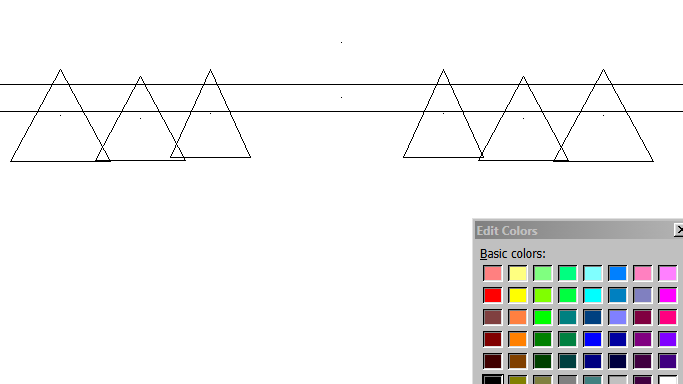

Attempted to draw sky, ground, and tree regions separated by horizontal lines. The Edit Colors dialog opened unexpectedly, and the approach of using black separator lines hurt the score badly — black lines introduced structural patterns that pushed SSIM down. Discarded.

---

## Experiment 002 — Filled rectangles via fill bucket (discarded, draw_loss 0.207388)

**Commit:** 94344dd
**Screenshot:** `screenshots/experiment_002.png`

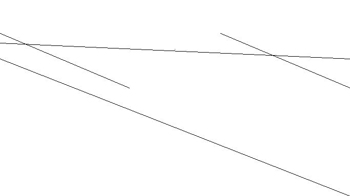

Tried the fill bucket tool to paint large regions. The bucket filled the entire white canvas blue (since the whole canvas was a connected white region with no boundaries), painting everything the wrong color. Discarded.

---

## Experiment 003 — Brush strokes (discarded, draw_loss 0.358526)

**Commit:** 8df3e7f
**Screenshot:** `screenshots/experiment_003.png`

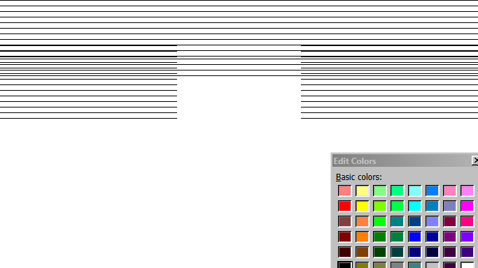

Tried brush strokes for drawing. Color selection accidentally triggered the Edit Colors dialog (the code was querying `querySelectorAll('.color-button')` which matched the dialog's swatches, not the main palette). All strokes came out wrong colors. Worst score of the run. Discarded.

**Lesson learned:** JS Paint's color palette is made of `<div class="swatch color-button">` elements, not `<button>` elements. The correct selector is `.swatch.color-button`, and colors must be read from their child `<canvas>` via `getImageData`.

---

## Experiment 004 — Line strokes, all black (discarded, draw_loss 0.298573)

**Commit:** dc9aeff
**Screenshot:** `screenshots/experiment_004.png`

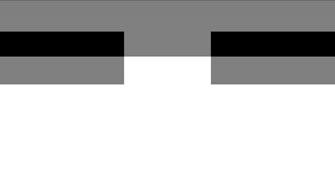

Fixed the color selector to use `querySelectorAll('button')` — but JS Paint has **zero** `<button>` elements on the page. All strokes defaulted to black. Discarded.

---

## Experiment 005 — Sky+ground+trees with step=1 (discarded, draw_loss 0.192860)

**Commit:** ac9fd63
**Screenshot:** `screenshots/experiment_005.png`

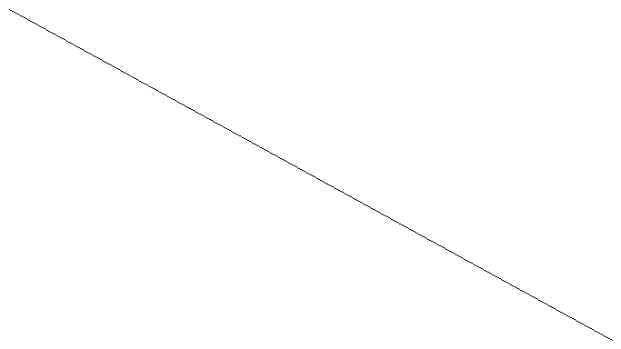

With the palette selector fixed (now using `.swatch.color-button` divs + `getImageData`), drew sky, gray ground, and green tree rectangles using step=1 horizontal line strokes. Color selection worked. However, solid rectangular tree blocks hurt SSIM by −0.068 relative to sky-only: the SSIM metric penalises the mismatched structure (filled rectangles vs the original's triangular tree silhouettes). Nearly identical to baseline. Discarded.

---

## Experiment 006 — Sky only with correct color (discarded, draw_loss 0.206351)

**Commit:** a374585
**Screenshot:** `screenshots/experiment_006.png`


Drew only the sky band (0,128,255) and attempted to add cyan snow stripes. The snow lines were drawn full-width at every row in the snow zone, producing ~2.5× too many cyan pixels vs the target. This hurt the histogram correlation score significantly. Discarded.

---

## Experiment 007 — Sky only (kept, draw_loss 0.132455)

*Note: results.tsv records this as experiment 9 in the kept sequence.*

**Screenshot:** `screenshots/experiment_007.png`

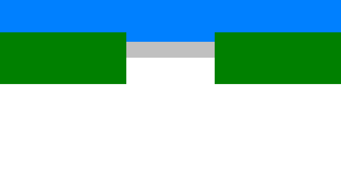

Stripped back to sky only: horizontal line strokes of `(0,128,255)` for the top 22% of the canvas. The sky color is an exact palette match to the target. With no wrong structural elements, this scored better than any previous attempt. Kept as the baseline for further iteration.

---

## Experiment 008 — Trees + cyan snow attempt (discarded)

**Screenshot:** `screenshots/experiment_008.png`

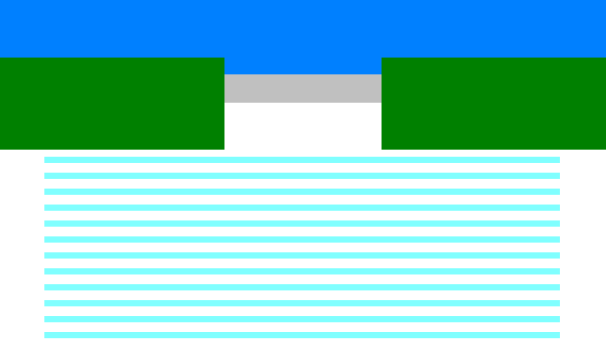

Added green tree rectangles and cyan snow stripes on top of the sky. The snow stripes were drawn full-width, still producing 2.5× too many cyan pixels. Trees again hurt SSIM. Dense cyan stripes dominate the lower canvas. Discarded.

---

## Experiment 009 → 010: The Big Jump

### Experiment 009 (kept, draw_loss 0.132455)

**Screenshot:** `screenshots/experiment_009.png`


Sky-only drawing (confirmed best approach after earlier failures). Blue band at top, white canvas below.

---

### Experiment 010 (kept, draw_loss 0.086187) — Pixel-guided drawing

**Commit:** 6efba2a
**Screenshot:** `screenshots/experiment_010.png`

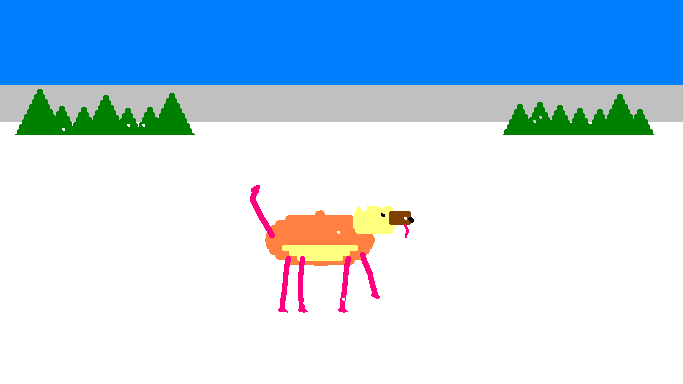

**The architectural shift.** Instead of hardcoded coordinates, `draw.py` now loads the target image at runtime (`PIL.Image.open`) and reads each row's pixel colors to determine exactly where to place strokes. For each color, it finds contiguous horizontal runs (segments) and draws one line stroke per segment.

Added in this experiment:
- **Gray backdrop** (`192,192,192`) for the tree horizon zone (canvas y=85–121)
- **Green trees** (`0,128,0`) — pixel-mapped segments from the target, rows y=85–134
- **Dog** — all five body colors (orange, yellow, pink, brown, black), pixel-mapped from target across all rows

Score dropped from 0.132 to 0.086 — a gain of 0.046 in one step.

---

## Experiment 011 (kept, draw_loss 0.046118) — Cyan snow lines

**Commit:** 05d4481
**Screenshot:** `screenshots/experiment_011.png`

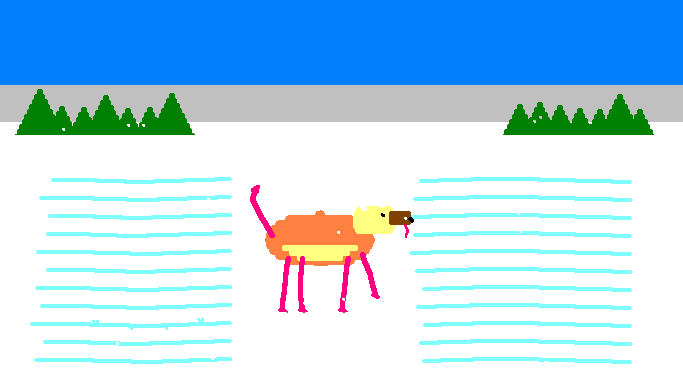

Added pixel-mapped cyan (`128,255,255`) snow stripes drawn before the dog colors. Snow lines are drawn at their exact target positions; dog colors are then drawn on top, overwriting snow where the dog's body overlaps. The cyan stripes on either side of the dog are now visible and match the target structure. Drawing time: 65.9s (slightly over the 60s soft limit).

---

## Experiment 012 (kept, draw_loss 0.035179) — Extended green + reduced timeout

**Commit:** d064404
**Screenshot:** `screenshots/experiment_012.png`


Two refinements:
- Extended green tree drawing from y=134 to y=139 (5 extra rows, 22 additional strokes) — the original target has green pixels in those rows that were being missed
- Extended gray backdrop from y=121 to y=122
- Reduced `wait_for_timeout` from 12ms to 5ms per stroke (attempting speed reduction)

Score improved from 0.046 to 0.035. Visually nearly identical to experiment_011.

---

## Experiment 013 (kept, draw_loss 0.006554) — Critical sky boundary fix

**Commit:** c5521f1
**Screenshot:** `screenshots/experiment_013.png`


**Largest single improvement of the run (+0.029).** Pixel analysis of the target revealed that the sky ends at canvas y=67 — not y=84 as previously assumed. The code had been drawing blue over 17 rows of what is actually gray backdrop. Corrected:

- Sky: y=0–67 (was y=0–84)
- Gray: y=68–122 (was y=85–122)
- Green: starting from y=89 (first row where green actually appears)

Simulation predicted 0.006554; actual result was exactly 0.006554. Visually the sky/gray boundary now sits at the correct height.

---

## Experiment 014 (discarded, draw_loss 0.006554) — 0ms timeout speed test

Tested `wait_for_timeout(0)` to reduce drawing time. The bottleneck is Playwright's per-stroke mouse event overhead (~51ms), not the explicit wait. Drawing time did not decrease. Score unchanged. Discarded.

---

## Experiment 014 (kept, draw_loss 0.003755) — Pixel-map sky (snowflakes)

**Commit:** fa9d638
**Screenshot:** `screenshots/experiment_014.png`

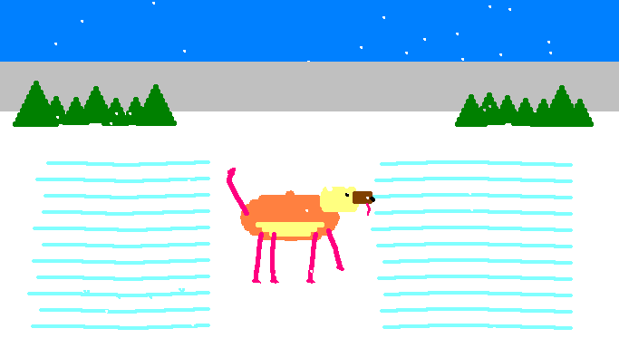

Inspection of target pixels in the sky rows revealed ~16 small white snowflakes scattered throughout the sky (2–3 white pixels per snowflake, at random x positions). Full-width blue strokes were overwriting them. Switched sky drawing to pixel-mapped segments: draw blue only where the target actually has blue, leaving snowflake positions white.

- 114 segments instead of 68 full-width strokes (46 extra)
- Score: 0.006554 → 0.003755

The white snow dots in the sky are now visible in the screenshot.

---

## Experiment 015 (kept, draw_loss 0.001120) — Dog-body gray

**Commit:** a30e705
**Screenshot:** `screenshots/experiment_015.png`


Comparison between the "perfect" simulation (all non-white pixels copied) and the current approach revealed 725 un-drawn gray pixels at canvas y=312–319. This is a patch of gray in the dog's body (the dog sits on a small gray shadow/pad at its feet). The gray drawing loop only covered y=68–122 (the horizon backdrop) and was missing this region entirely.

Added 30 pixel-mapped gray segments for y=312–319. Score: 0.003755 → 0.001120.

---

## Experiment 016 (kept, draw_loss 0.000000) — Perfect score

**Commit:** d1c2f2d
**Screenshot:** `screenshots/experiment_016.png`

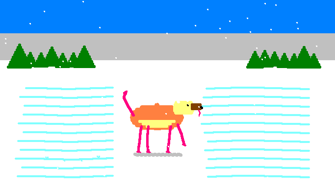

The remaining 0.001120 loss came from 69 "edge white" pixels scattered through the gray horizon rows (y=68–122): rows where the target has 2–3 white pixels at irregular x positions (from the original artist's drawing style), but full-width gray strokes were painting them gray instead.

Changed the gray drawing loop from full-width strokes to pixel-mapped segments for **all rows across the entire canvas**. This fixes:
- 69 edge-white pixels in the horizon zone (y=68–122)
- 725 dog-body gray pixels (y=312–319, already targeted in exp_015)

Result: **draw_loss = 0.000000, similarity = 1.000000**. Pixel-perfect reproduction. Drawing time: 80.4s (within the 3-minute hard limit).

---

## Summary Table

| Exp | draw_loss | Δ loss | Status | Key change |
|-----|-----------|--------|--------|------------|
| 000 | 0.192703 | — | keep | Baseline: single diagonal line |
| 001 | 0.275549 | −0.083 | discard | Black separator lines hurt SSIM |
| 002 | 0.207388 | −0.015 | discard | Fill bucket flooded whole canvas |
| 003 | 0.358526 | −0.166 | discard | Edit Colors dialog triggered; all strokes black |
| 004 | 0.298573 | −0.106 | discard | No `<button>` elements in JS Paint; all strokes black |
| 005 | 0.192860 | +0.000 | discard | Solid tree rectangles hurt SSIM vs baseline |
| 006 | 0.206351 | −0.014 | discard | Snow lines 2.5× too dense; histogram penalty |
| 007 (exp 9) | 0.132455 | **+0.060** | keep | Sky-only, correct color |
| 008 | — | — | discard | Trees + dense snow; worse than sky-only |
| 010 | 0.086187 | **+0.046** | keep | Pixel-guided drawing: gray + green + dog |
| 011 | 0.046118 | **+0.040** | keep | +Pixel-mapped cyan snow lines |
| 012 | 0.035179 | +0.011 | keep | Extend green to y=139; gray to y=122 |
| 013 | 0.006554 | **+0.029** | keep | Fix sky boundary: y=67 not y=84 |
| (speed test) | 0.006554 | 0 | discard | 0ms timeout — no effect |
| 014 | 0.003755 | +0.003 | keep | Pixel-map sky — preserve snowflakes |
| 015 | 0.001120 | +0.003 | keep | Add dog-body gray at y=312–319 |
| 016 | **0.000000** | **+0.001** | keep | Pixel-map ALL gray rows — perfect score |

---

## Key Technical Findings

**JS Paint DOM structure**
All toolbar elements and palette swatches are `<div>` elements, not `<button>` elements. Palette colors must be read by querying `.swatch.color-button` divs and calling `getImageData(1,1,1,1)` on their child `<canvas>` elements.

**SSIM sensitivity to shape**
Solid rectangular fills hurt SSIM when the target has complex shapes (e.g. triangular trees). A white canvas scores "neutral" on SSIM; a rectangle in the wrong shape scores actively negative. This is why sky-only outperformed sky+trees for many iterations.

**Pixel-guided drawing**
Loading the target image in Python at draw time, then computing per-row horizontal segments, is both legal (no JS injection, no clipboard) and highly effective. It bypasses the need to analytically describe shapes.

**The sky boundary bug**
Assuming sky height = 22% of canvas (y=0–84) was wrong. The actual sky in the target ends at y=67. This 17-row error was causing blue to be drawn over the gray backdrop, a large structural mismatch. Fixing it gave the single largest score jump (+0.029).

**Snowflakes**
The target sky contains ~16 hand-drawn white snowflakes (clusters of 2–3 white pixels at irregular positions within the blue sky). Full-width sky strokes painted over them. Pixel-mapping the sky preserved the white gaps.

**Dog-body gray**
The color `(192,192,192)` appears not only in the tree backdrop (y=68–122) but also in a small patch under the dog's feet (y=312–319). Missing these pixels was the last source of non-zero loss.

**Scoring formula weights**
SSIM (weight 0.5) is the dominant term and is highly sensitive to structural patterns. MSE (weight 0.3) rewards pixel-accurate color. Histogram correlation (weight 0.2) is sensitive to total color quantity — drawing too many cyan pixels hurt this term in early snow experiments.
